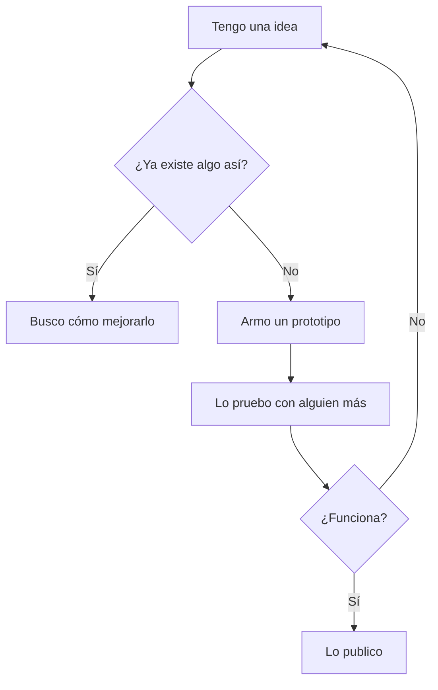
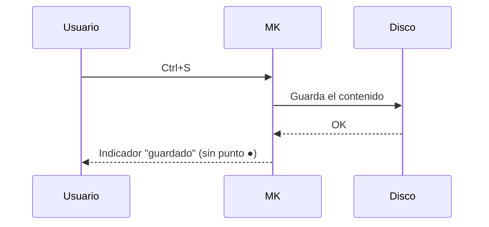
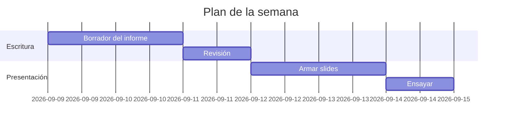

# Diagramas Mermaid

Abrí este archivo en MK y mirá el panel de preview — cada bloque de abajo se dibuja solo, no se muestra como texto.

## Flowchart

```mermaid
graph TD;
Idea[Tengo una idea] --> Investigo{¿Ya existe algo así?};
Investigo -->|Sí| Mejoro[Busco cómo mejorarlo];
Investigo -->|No| Prototipo[Armo un prototipo];
Prototipo --> Pruebo[Lo pruebo con alguien más];
Pruebo --> Funciona{¿Funciona?};
Funciona -->|Sí| Publico[Lo publico];
Funciona -->|No| Idea;
```

## Diagrama de secuencia

```mermaid
sequenceDiagram
participant Usuario
participant MK
participant Disco
Usuario->>MK: Ctrl+S
MK->>Disco: Guarda el contenido
Disco-->>MK: OK
MK-->>Usuario: Indicador "guardado" (sin punto ●)
```

## Gantt

```mermaid
gantt
title Plan de la semana
dateFormat YYYY-MM-DD
section Escritura
Borrador del informe :a1, 2026-09-09, 2d
Revisión             :after a1, 1d
section Presentación
Armar slides          :2026-09-12, 2d
Ensayar               :2026-09-14, 1d
```
